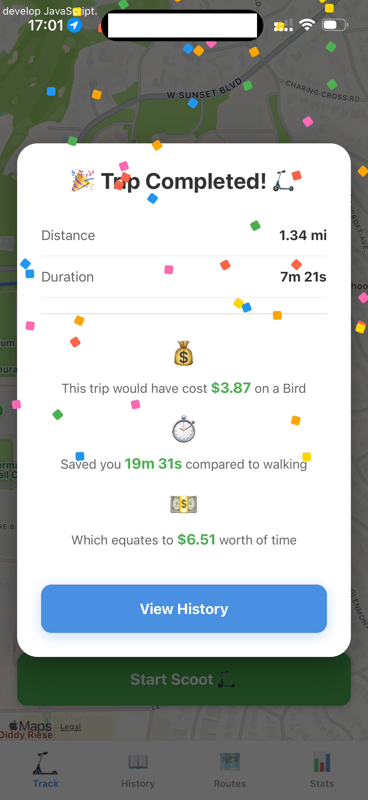
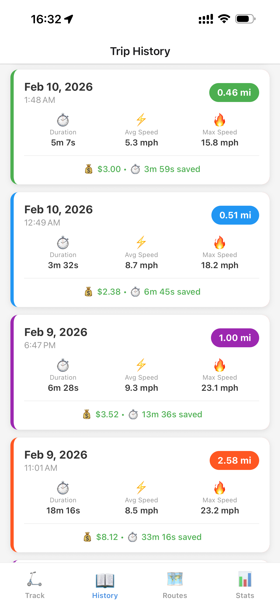
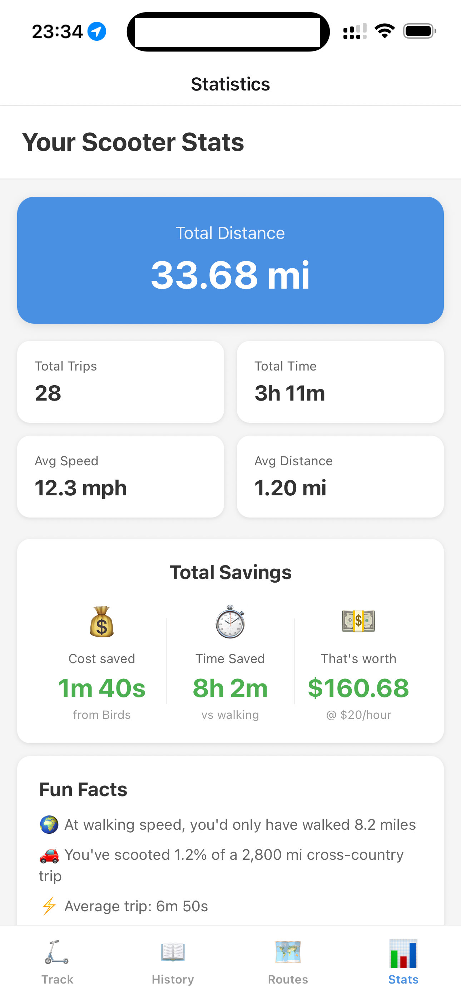

Scooters are awesome. I built this app to prove it to my peers.  
It tracks scooter trips - even when the phone is locked - to show the time saved and costs saved. 

# Rundown:
Press "Start Scoot" on the **Tracking tab**, then the route will be shown like the screenshot below. 

  

**Smart detection**: for tracking, the app will automatically sense when the trip actually begins and ends, so that you can take time to settle down before pressing the stop trip button, and take some time to get ready after pressing start scoot. 

Pressing "Stop Scoot" will bring up a celebratory page with trip statistics:

The **History**tab will show all previous trips, color coded by distance:

The **Heatmap** tab shows the routes travelled most frequently. It's also nice to visualize all the places you've been to!

The **Stats** tab shows cumulative mileage and savings: 

